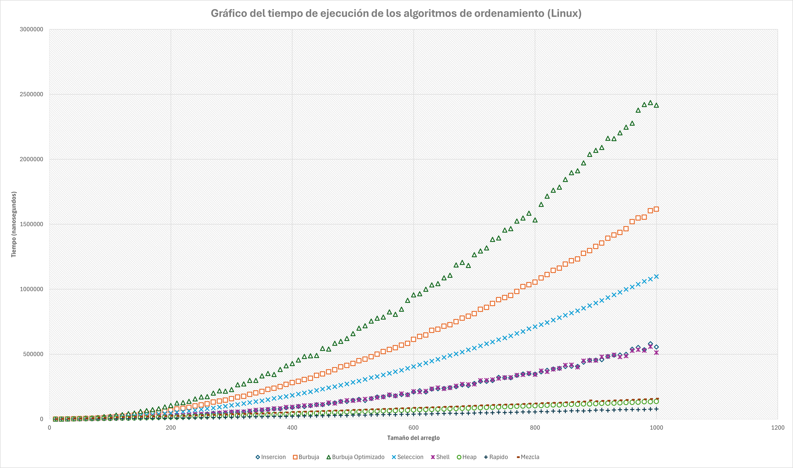
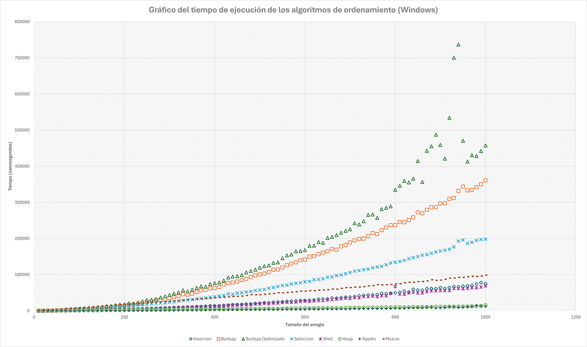

# Análisis comparativo de la eficiencia los algoritmos de ordenamiento
Este repositorio contiene un programa que analiza los tiempos de ejecución de ocho algoritmos de ordenamiento con el propósito de comparar de manera experimental la eficiencia de cada uno de ellos.

1. Algoritmo de Inserción
   - Este algoritmo consiste en mover e insertar los elementos más grandes a lo largo de la sucesión hasta encontrar su posicición correcta, de tal manera de que los elementos menores a este se recorren a la izquierda hasta obtener que el el arreglo se encuentre ordenado.

2. Algoritmo de Ordenamiento de Burbuja
   - Este algoritmo recorre repetidamente una lista, intercambiando los elementos si estan fuera de orden, hasta llegar al final de la lista ordenada.
     
3. Algoritmo de Ordenamiento de Burbuja Optimizado
   - Esta es una modificación del algoritmo de burbubja en donde se evalúa si el elemento ya está intercambiado, en caso de ser falso, se procede a realizar el mismo algoritmo de burbuja.
  
4. Algoritmo de Ordenamiento por Selección
   - Este algoritmo divide el arreglo en dos sublistas, una ordenada y otra por ordenar. Se busca en la lista no ordenada el elemento mínimo y lo coloca al final de la lista ordenada.

5. Algoritmo de Ordenamiento por Mezcla (Merge Sort)
   - Este algoritmo divide el arreglo en mitades de manera recursiva de tal manera que se obtienen dos sublistas de tamaños decrecientes: una izquierda y una derecha. Se ordenan las sublistas y luego se mezclan de manera que queda una sublista de tamaño superior ya ordenada.

6. Algoritmo de Ordenamiento Rápido (Quick Sort)
   - Este algoritmo ordena de manera recursiva seleccionando un elemento como el pivote y divide el arreglo alrededor del pivote. Los elementos  de menor tamaño que el pivote se mueven a la izquierda y los de mayor tamaño a la derecha. Luego se ordenan estas particiones de manera separada hasta terminar con el arreglo.

7. Algoritmo de Ordenamiento por Montículos (Heap Sort)
   - Este algoritmo utiliza una estructura de datos llamada montículo (heap) para ordenar arreglos. El algoritmo construye el montículo y luego extrae repetidamente el elemento máximo y lo reubica al final del arreglo.
  
8. Algoritmo de Ordenamiento por Inserción con Intervalos Decrecientes (Shell Sort)
   - Este algoritmo es una modificación del algoritmo de inserción. Ordena los elementos separados por una distancia (gap) definida por el programador. Esta distancia se va reduciendo hasta llegar a 1, en donde el algoritmo se comporta como un algoritmo de inserción normal, con la ventaja de tener una lista ya casi ordenada. En este experimento en particular, se utilizó la secuencia de Shell original reducida con fines ilustrativos:

Secuencia utilizada:
```
[n/2, 1]
```

## Estructura del repositorio
* Datos: Aquí se encuentran los archivos .csv crudros de los tiempos de ejecucción de cada uno de los algoritmos. Dentro de esta carpeta puede encontrar por separado las corridas en Linux y en Windows 11.
* Documentation/html: Contiene los archivos necesarios para abrir la documentación de Doxygen.
* Doxygen: Archivo de formato para Doxygen.
* Imagenes: Contiene los gráficos comparativos de los algoritmos para Linux y Windows 11.
* **<ins>Documentacion.lnk : Documentación del código fuente.</ins>**

## Archivos de código
* AlgoritmosOrden.hpp : Prototipos de las funciones de ordenamiento.
* FuncionesAuxiliares.hpp: Prototipos de las funciones auxiliares.
* ComparacionAlgoritmosOrden.cpp : Código fuente principal.
* AlgoritmosOrden.cpp : Definiciones de los algoritmos de ordenamiento.
*  FuncionesAuxiliares.cpp: Definiciones de las funciones auxiliares.
  
## Requisitos del sistema
* C++ 20
* Compilador g++
* Visual Studio 2022 (para Windows)

> [!WARNING]
> El programa fué escrito en una computadora con sistema operativo Windows 11, es posible que algunas instrucciones arrojen una advertencia en Linux.

## Instrucciones de compilación
### Linux
1. Clone el repositorio:
```
git clone https://github.com/Cydraa/ComparacionAlgoritmoOrden.git
cd ComparacionAlgoritmoOrden/ComparacionAlgoritmosOrden/
```
2. Compile el código
```
g++ -o ordenamiento ComparacionAlgoritmosOrden.cpp AlgoritmosOrden.cpp FuncionesAuxiliares.cpp -std=c++20
```

3. Ejecute el programa
```
./ordenamiento
```

### Windows
1. Clone el repositorio:
```
git clone https://github.com/Cydraa/ComparacionAlgoritmoOrden.git
cd ComparacionAlgoritmoOrden/ComparacionAlgoritmosOrden/
```
2. En la carpeta ComparacionAlgoritmoOrden/ComparacionAlgoritmosOrden/, abrir el archivo ComparacionAlgoritmosOrden.sln usando Visual Studio 2022.
3. Compile el código: haciendo click derecho sobre la solución en el explorador de la solución (Build Solution...) o pulsando CTRL+SHIFT+B.
5. Ejecute el programa: Pulse CTRL+F5 o haga click en "Start without debugging" en la parte superior del IDE.

## Diseño del experimento
Se generaron arreglos de tamaño creciente, con un mínimo de 10 y un máximo de 1000, con incrementos de 10. Los valores de los arreglos se asignaron de manera aleatoria en un rango de enteros del 1 al 1000. Estos arreglos se ordenaron por 8 algoritmos de ordenamiento distintos, en donde cada prueba (tamaño y algoritmo) se ejecutó 1000 veces.

## Resultados del análisis y conclusión
El programa se ejecutó de manera exitosa en dos sistemas operativos: Linux CachyOS y Windows 11. Como se puede observar en las gráficas siguientes, los algoritmos de ordenamiento **menos eficientes** fueron: **Burbuja Optimizado, Burbuja y Selección** para ambos sistemas, mientras que los **más eficientes** fueron **Heap Sort, Quick Sort y Merge**. Aunque podemos observar que Merge Sort se comporta de manera diferente en Windows. Se puede también notar una menor variabilidad de los datos en las corridas de Linux en comparación con las de Windows 11. Esto se puede deber a los procesos de segundo plano de Windows que pudieron haber afectado los tiempos de ejecucción de los algoritmos, especialmente en los arreglos de mayor tamaño.

En conclusion, en los algoritmos menos eficientes se puede observar un comportamiento del tipo cuadratico. Mientras que en los tres mas rapidos, el comportamiento es logarítmico. Además de que el mejor sistema operativo para estudiar el comportamiento de los algoritmos es Linux, ya que este sistema operativo introduce menos ruido al momento de cronometrar el tiempo de ejecucción.

 


 %20Core(TM)%20i7%2011700F-purple)

